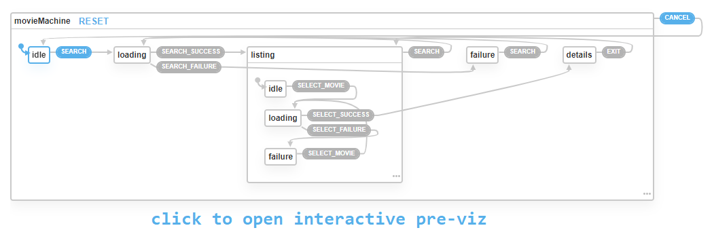

# Test developpeur front-end

## app machine

---
Ce projet à été généré à l'aide de [Nx](https://nx.dev).

## 🛫 Installation

`npm run start` pour lancer le serveur de developpement.

L'application se trouve dans le dossier `apps/react-app/src`.

## ✈️ Objectifs

Créer une simple application permettant de rechercher un film.

L'application se présente sous la forme d'une seule page (pas de routing) avec une barre de recherche et une liste de résultats. Lorsque l'on clique sur un résultat, une fenetre s'ouvre avec les détails du film.

Pour se faire, utiliser l'API [OMDB](http://www.omdbapi.com).

Utiliser l'API avec le paramètre de recherche (par exemple : `?s=Matrix`) pour récupérer la liste des films. Afficher toutes les données recues dans la liste.

Utiliser l'API avec le paramètre ID (par exemple : `?i=tt7002456`) pour récupérer les détails d'un film a partir de l'ID du résultat de recherche. Afficher les infos de la liste + le synopsis et la liste des acteurs dans la fenetre.

## ⚠️ Contraintes

- Utiliser les composants de la librairie [Material UI](https://material-ui.com/) pour la barre de recherche, la liste de résultats, et la fenetre.
- Utiliser des Function Components et les Hooks React. Pas de Class Components.
- Utiliser async / await lors du traitement de Promises. Pas de then() / catch() ou de callbacks.
- Utiliser fetch pour effectuer les requêtes à l'API. Pas de librairie externe tel Axios.
- Utiliser Redux pour gérer la liste des films, les états de chargement et d'erreur dans la liste, et la fenetre de détails (son état ouvert/fermé et son contenu). Utiliser useState la barre de recherche.
- Utiliser le module [Redux Toolkit](https://redux-toolkit.js.org) pour configurer Redux.
- Utiliser Typescript !
  - Créer des types Movie et MovieSearchResult utilisables dans toute l'application.
  - Créer une classe Omdb qui fait office de service pour appeller l'API avec la fonction de recherche et de récupération de film. (nommées searchMovies et getMovie par exemple).

## 💡 Pensez-y

- Gérez les erreurs et affichez un message dans l'interface (pas seulement dans la console ou avec une alert box)
- Gérer les temps de chargement avec des loaders
